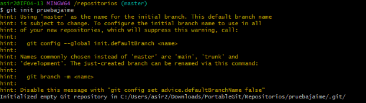
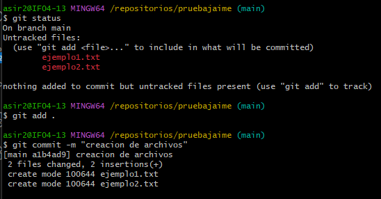
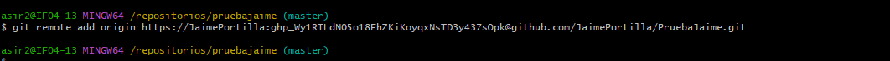
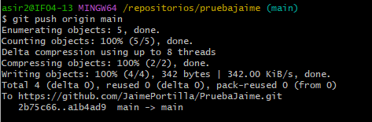
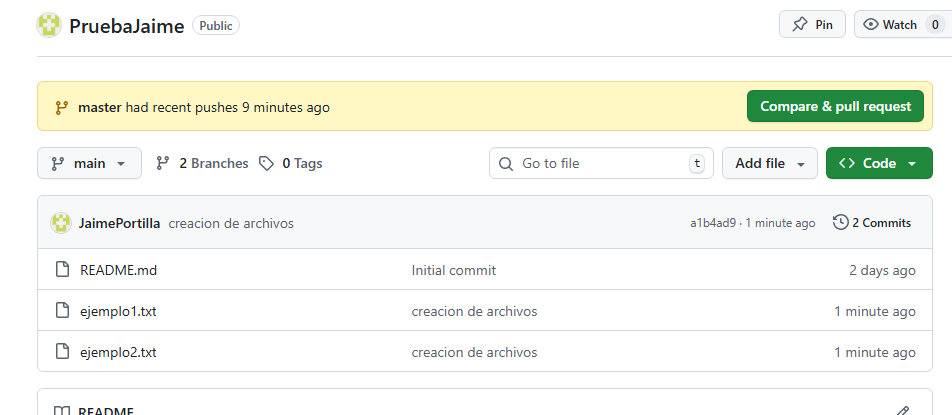
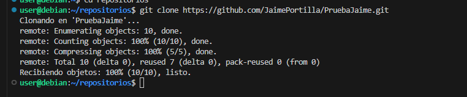
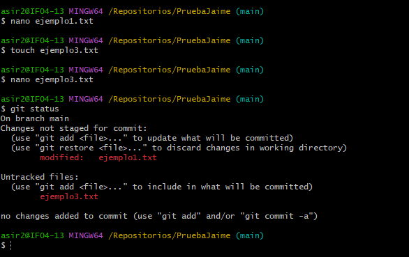
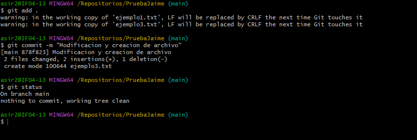
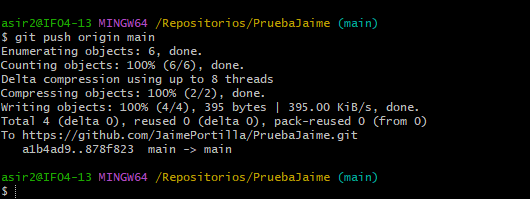
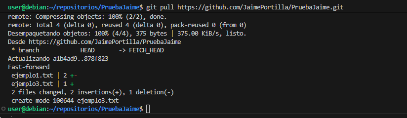

# Documentación del Proyecto: `Prueba_Jaime`
## 1. Creación del Repositorio Local en Windows

Primero, se creó un nuevo directorio para el repositorio local y se inicializó Git.

Luego, se crearon dos archivos de texto con contenido libre.

Una vez hecho el git add . se hizo el primer git commit

Luego, se conectó el repositorio local al remoto con el siguiente comando:

El repositorio local fue subido al repositorio remoto en GitHub

Aqui la comprobación de ello

Desde una máquina virtual con Linux Debian, se clonó el repositorio remoto:

Desde el sistema Windows, se realizó una modificación en uno de los archivos existentes y se creó un nuevo archivo

Se añadieron y confirmaron los cambios

Se subieron los cambios al repositorio remoto

Finalmente, desde la máquina virtual con Linux Debian, se actualizó la versión local del repositorio para reflejar los últimos cambios

