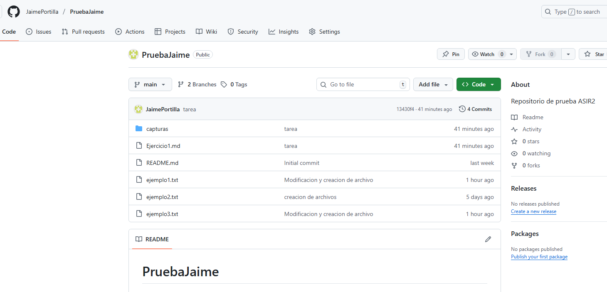

# Título Principal

## Subtítulo

Este es un párrafo con palabras en **negrita**, en *cursiva*, y en `código`.
```bash
print("Hola")
```
Lista Ordenada

1. Primer elemento
2. Segundo elemento
3. Tercer elemento
4. Cuarto elemento


Lista Desordenada

* Elemento uno
* Elemento dos
* Elemento tres

[Visita Google](https://www.google.com)


[Ejercicio1](ejercicio1.md)



| Encabezado 1 | Encabezado 2 | Encabezado 3 |
|--------------|--------------|--------------|
| texto|            texto         |texto|
| texto             | texto        | texto|


