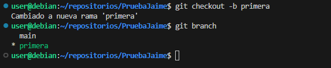
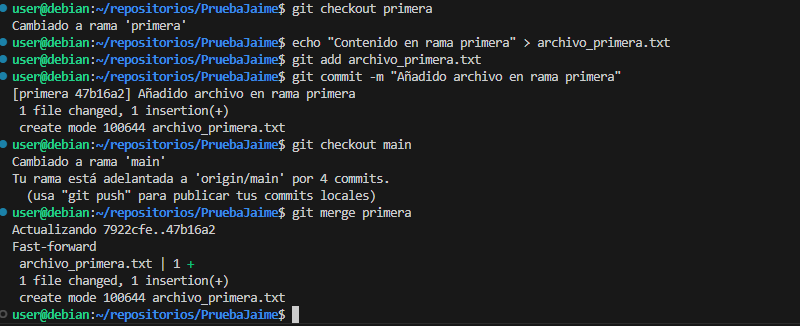
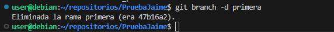
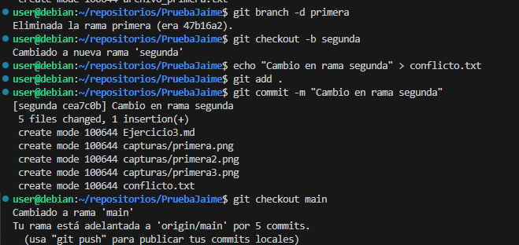
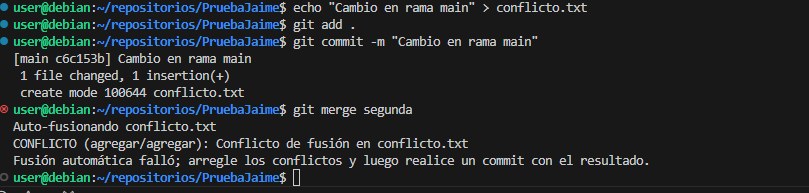
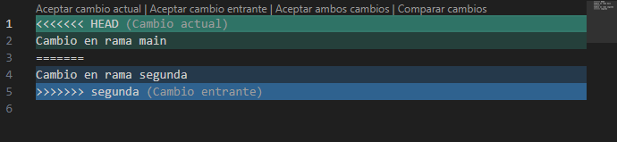
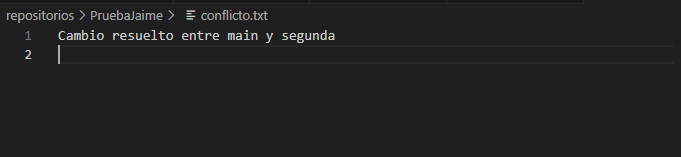
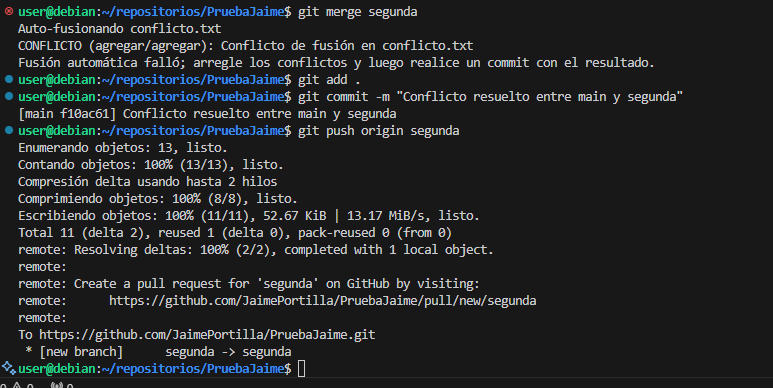

# Ejercicio 3 - Trabajo con ramas en Git

## 1. Crear la rama `primera` y comprobar su creación

## 2. Crear un nuevo fichero en esta rama y fusionarlo con `main`

## 3. Borrar la rama primera

## 4. Crear una rama segunda y provocar un conflicto

## 5. Solución del conflicto

# Modificamos el texto del conflicto

